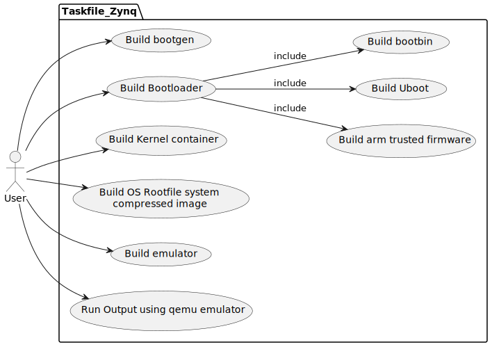

# Motivation

The purpose of this repository is to provide a complete build system based on task files.

Task files are YAML schema based file containing OS commands or procedures. It is written
in the go language. For more informations visit:

https://taskfile.dev/

The taskfiles based build system will provide the means to build Linux components needed
for running Embedded Linux on the Armv8a Xilinx Zynq Ultrascale+ SOC.

---

## Use Cases

This repository means to support main build system use cases for Linux on Ultrascale SOC.

